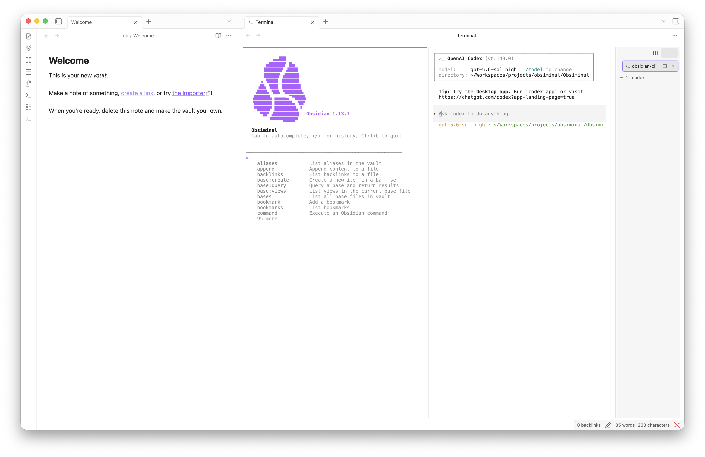

# Vault Shell

An interactive terminal that runs inside your Obsidian workspace.

Vault Shell opens a real PTY-backed shell in a standard Obsidian pane. Dock it beside your
notes, move it to the bottom of the workspace, or keep it as a tab wherever it fits your
workflow.



> [!IMPORTANT]
> Vault Shell 0.1.0 is an early macOS-only release that must be installed manually. It does
> not support Obsidian Mobile and is not yet available in the Community Plugins directory.

## Features

- Open or focus the terminal with a ribbon icon or the command palette.
- Start each shell in the root directory of the current vault.
- Discover installed shells from `$SHELL`, `/etc/shells`, and `$PATH`.
- Create, switch between, and close multiple terminal sessions from a vertical manager.
- Split terminals side by side in the same group and drag the divider to resize each pane.
- Update each terminal label from its foreground process, then restore the shell name when the
  command exits.
- Run interactive programs with ANSI colors, `Ctrl+C`, terminal resizing, and up to 5,000
  lines of scrollback.
- Keep sessions running when the terminal pane is closed, then reconnect when it is opened
  again.
- Follow Obsidian's light or dark theme automatically.

## Requirements

| Requirement      | Version or details                                     |
| ---------------- | ------------------------------------------------------ |
| Operating system | macOS                                                  |
| Obsidian         | 1.7.2 or later                                         |
| Vault            | Local filesystem vault                                 |
| Node.js          | 24 or later, required for installation and development |
| npm              | Included with Node.js                                  |

You may also need the Xcode Command Line Tools if `node-pty` must be compiled locally:

```sh
xcode-select --install
```

## Installation

Vault Shell is not currently distributed through Obsidian's Community Plugins directory.
Install it from source in a test vault:

```sh
cd "/path/to/Your Vault/.obsidian/plugins"
git clone <repository-url> obsiminal
cd obsiminal
npm install
npm run build
```

Then:

1. Open **Settings → Community plugins** in Obsidian.
2. Turn on community plugins if they are disabled.
3. Select **Vault Shell** and enable it.

The plugin directory must remain named `obsiminal`. Keep `node_modules/node-pty` in the
plugin directory because the native PTY module is intentionally loaded outside the bundled
`main.js` file.

If you installed dependencies before the native preparation script was added, run:

```sh
npm run native:prepare
```

## Usage

Open the terminal in any of the following ways:

- Select the terminal icon in the ribbon.
- Run **Vault Shell: Open or focus terminal** from the command palette.

Once the terminal is open:

- Drag the **Terminal** tab to dock it anywhere in the workspace.
- Select **+** to create a terminal with the default shell.
- Select the arrow beside **+** to choose another detected shell.
- Select **Split terminal** on the toolbar to open another shell beside the active one.
- Select a terminal in the right sidebar to switch sessions. Split sessions are shown as a
  connected group.
- Drag the divider beside the terminal manager to resize the sidebar; double-click it to restore
  the default width.
- Select **×** on a terminal row to close that session and terminate its process.

You can assign your preferred shortcut under **Settings → Hotkeys**.

### Commands

| Command                                 | Default hotkey | Description                                          |
| --------------------------------------- | -------------- | ---------------------------------------------------- |
| **Vault Shell: Open or focus terminal** | None           | Opens the terminal pane or focuses the existing one. |
| **Vault Shell: New terminal**           | None           | Opens the pane and creates a new terminal session.   |
| **Vault Shell: Split terminal**         | None           | Splits the active terminal into another pane.        |

## Security and privacy

Vault Shell does not require an account, collect telemetry, or make network requests on its
own.

The terminal runs with the same permissions as Obsidian. It reads system shell information
outside the vault and launches a real shell at the vault root. Commands entered in that shell
can read, change, or delete files anywhere your user account can access, and they may connect
to the network. Review commands before running them and use a test vault while evaluating the
plugin.

## Troubleshooting native `node-pty`

`node-pty` contains a native binary. Errors such as `NODE_MODULE_VERSION`,
`Module did not self-register`, or a failure to load `pty.node` usually mean that the binary
was built for a different ABI than the Electron version used by Obsidian.

1. In Obsidian, open **Developer tools → Console** and run:

   ```js
   process.versions.electron;
   ```

2. Rebuild `node-pty` from the plugin directory using the returned Electron version:

   ```sh
   npm install-scripts approve node-pty
   npm rebuild node-pty \
     --runtime=electron \
     --target=<electron-version> \
     --dist-url=https://electronjs.org/headers
   npm run build
   ```

3. Quit Obsidian completely, then reopen it.

## Development

Clone the repository anywhere on your machine, then link it into a test vault:

```sh
mkdir -p "/path/to/Test Vault/.obsidian/plugins"
ln -s "/absolute/path/to/obsiminal" "/path/to/Test Vault/.obsidian/plugins/obsiminal"
cd "/absolute/path/to/obsiminal"
npm install
npm run dev
```

After a source change, run **Reload app without saving** from Obsidian's command palette.
You can also disable and re-enable the plugin.

Run the complete quality check before submitting a change:

```sh
npm run validate
```

This command runs ESLint, Prettier checks, tests, TypeScript type checking, and a production
build. The build writes the Obsidian plugin artifacts to the repository root:

- `main.js`
- `manifest.json`
- `styles.css`

### Project structure

- `VaultShellPlugin` manages commands, the workspace view, and terminal sessions.
- `TerminalSession` owns the PTY process and its lifecycle.
- `XtermSurface` manages the xterm.js interface, scrollback, and theme.
- `TerminalView` renders shell selection and session tabs.

## Current limitations

- macOS only.
- Local filesystem vaults only.
- Sessions do not survive an Obsidian restart, reload, or plugin disable.
- Shell, font, and working-directory settings are not configurable yet.
- Native binaries are not downloaded or rebuilt automatically.
- Installation through the Community Plugins directory is not available yet.

## Contributing

Bug reports and pull requests are welcome. Before opening a pull request, run
`npm run validate` and test the plugin in a separate vault.

## License

Vault Shell is available under the [MIT License](LICENSE).
