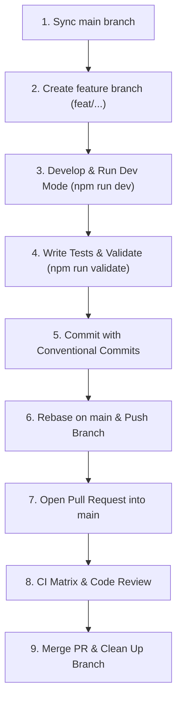

# Feature Development Workflow

This document outlines the standard end-to-end development workflow for contributing new features, bug fixes, and improvements to **Obsiminal** (Vault Shell), from creating a branch to opening and merging a Pull Request (PR) into `main`.

---

## 🗺️ Workflow Overview



---

## Step 1: Environment Setup & Sync with `main`

1. **Verify Node.js version**:
   The project requires **Node.js >= 24** (as defined in [.nvmrc](../.nvmrc)).

   ```bash
   nvm use
   # or check version: node -v
   ```

2. **Switch to `main` and pull the latest changes**:

   ```bash
   git checkout main
   git pull origin main
   ```

3. **Install or update dependencies**:
   ```bash
   npm ci
   ```

---

## Step 2: Create a Feature Branch

Create a new branch off `main` using standard branch naming prefixes:

| Branch Prefix | Purpose                                     | Example                      |
| :------------ | :------------------------------------------ | :--------------------------- |
| `feat/`       | New feature implementation                  | `feat/custom-font-settings`  |
| `fix/`        | Bug fixes                                   | `fix/pty-spawn-path-spaces`  |
| `refactor/`   | Code refactoring without behavioral changes | `refactor/terminal-manager`  |
| `docs/`       | Documentation additions or updates          | `docs/workflow-guide`        |
| `test/`       | Adding or updating tests                    | `test/split-pane-unit-tests` |

**Command**:

```bash
git checkout -b feat/<feature-name>
```

---

## Step 3: Feature Development & Testing

1. **Start development watch mode**:

   ```bash
   npm run dev
   ```

   _This command stages the native PTY runtime and runs `esbuild` in watch mode, continually compiling source code into `main.js`._

2. **Live testing in Obsidian (Test Vault)**:
   Create a symbolic link from the repository to your Obsidian test vault's plugin directory (one-time setup):

   ```bash
   mkdir -p "/path/to/Your Test Vault/.obsidian/plugins"
   ln -s "$(pwd)" "/path/to/Your Test Vault/.obsidian/plugins/obsiminal"
   ```

   After modifying source code, open Obsidian and trigger **Reload app without saving** from the Command Palette (`Cmd+P` or `Ctrl+P`) or toggle the plugin off/on in Settings.

3. **Key project files**:
   - `src/main.ts`: Plugin entry point, registers commands, ribbon icon, and views.
   - `src/terminal/`: Manages PTY sessions, xterm instances, and shell discovery.
   - `src/settings.ts` & `src/settings-data.ts`: Plugin settings interface and data models.
   - `src/styles.css`: CSS styles for the terminal surface, tabs, and sidebar.
   - `tests/`: Unit and integration test suites.

---

## Step 4: Quality Checks & Testing

1. **Write unit tests**:
   Add test cases for your changes in the `tests/` directory using **Vitest**:

   ```bash
   npm run test:watch  # Run tests in watch mode
   # or
   npm test            # Run full test suite once
   ```

2. **Run the full quality check suite**:
   ```bash
   npm run validate
   ```
   > [!IMPORTANT]
   > Running `npm run validate` is required before committing and pushing. It executes:
   >
   > 1. `npm run lint`: ESLint static analysis and style checks.
   > 2. `npm run format:check`: Prettier code formatting verification.
   > 3. `npm test`: Full Vitest suite execution.
   > 4. `npm run build`: Type checking (`tsc --noEmit`), native runtime staging, and production bundle build.

---

## Step 5: Commit Changes (Conventional Commits)

The repository uses **Husky** and **nano-staged** to automatically lint and format staged files upon committing.

Follow the **Conventional Commits** specification:

- `feat: add configurable font family and size`
- `fix: resolve issue where terminal tab cannot be closed`
- `test: add unit tests for terminal split layout`
- `docs: update feature development workflow documentation`

```bash
git add .
git commit -m "feat: <concise description of changes>"
```

---

## Step 6: Rebase on `main` Before Pushing

Keep your branch up to date and conflict-free with `main`:

```bash
git fetch origin
git rebase origin/main
```

_(If conflicts arise, resolve them, run `git add .`, and continue with `git rebase --continue`)_.

---

## Step 7: Push Branch & Open a Pull Request

1. **Push your branch to the remote repository**:

   ```bash
   git push -u origin feat/<feature-name>
   ```

2. **Create a Pull Request on GitHub**:
   - **Base branch**: `main`
   - **Compare branch**: `feat/<feature-name>`
   - **PR Title**: `feat: <feature description>` (or `fix: ...`)
   - **PR Description Template**:

   ```markdown
   ## 🎯 Purpose

   Brief description of the feature or bug resolved by this PR.

   ## 🛠️ Key Changes

   - Added font settings in the Settings tab.
   - Updated XtermSurface to apply font properties dynamically.
   - Added unit tests in `tests/settings.test.ts`.

   ## 🧪 Test Plan

   - [x] Ran `npm run validate` (all checks passed).
   - [x] Verified functionality in Obsidian Desktop.
   - [x] Tested both Light and Dark themes.

   ## 📸 Screenshots / Demos (if applicable)
   ```

---

## Step 8: CI Automation & Merge

1. **Continuous Integration (CI)**:
   Opening a PR triggers the [.github/workflows/ci.yml](../.github/workflows/ci.yml) workflow:
   - **Quality checks**: Runs `npm run validate` on Ubuntu.
   - **Native smoke matrix**: Runs native PTY smoke tests across 6 platforms:
     - `macOS` (`darwin-x64`, `darwin-arm64`)
     - `Windows` (`win32-x64`, `win32-arm64`)
     - `Linux` (`linux-x64`, `linux-arm64`)

2. **Review & Merge**:
   - Ensure all CI status checks are passing (✅).
   - Address any reviewer feedback.
   - Merge the PR into `main` (Squash and merge or Rebase and merge recommended).

3. **Post-Merge Cleanup**:
   ```bash
   git checkout main
   git pull origin main
   git branch -d feat/<feature-name>
   ```
